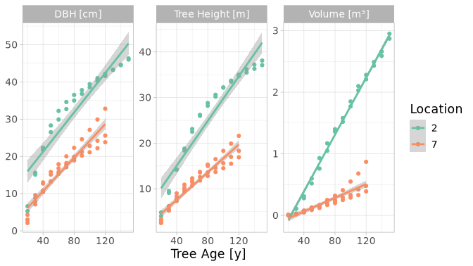
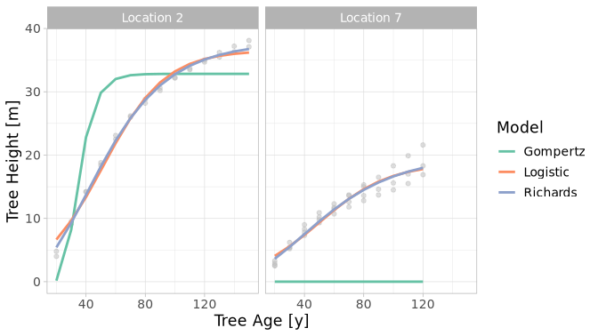
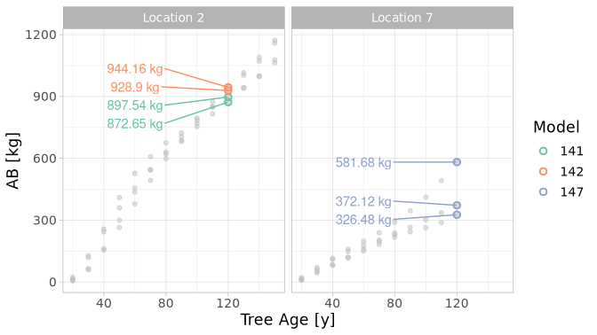

# Methods of Process Modelling
Max Arthur Hachemeister
2026-02-22

- [1
  Introduction](#introduction)
- [2 Material and
  Methods](#material-and-methods)
  - [2.1 Initial
    Data](#initial-data)
  - [2.2 Software](#software)
  - [2.3 Tree Volume
    Calculation](#tree-volume-calculation)
  - [2.4 Relevant
    Strata](#sec-location)
  - [2.5 Growth
    Models](#sec-growth-models)
  - [2.6 Allometric
    Models](#sec-allometric-models)
- [3 Results](#results)
  - [3.1 Model
    Fit](#sec-results-growth)
  - [3.2 Above Ground
    Biomass](#above-ground-biomass)
- [4 Conclusion](#conclusion)
- [Appendix](#sec-appendix)

# Introduction

Statistical models are invaluable tools for deriving and predicting
variables relevant to applied and scientific forest ecology alike. These
models not only help scale the time and space dimensions of forest
ecosystem to scopes comprehensible by humans, and allow therefore to
virtually test and evaluate forest management approaches, and also
anticipate relevant developments like climate change, so to effectively
inform land managers in a timely manner (Pretzsch 2009, ch. 1 11).

However, diligence is due when models are to be selected and applied to
a given question or an actual tree stand, as there are many models for a
wide range of applications, with varying quality, to choose from. It
takes both statistical understanding and domain knowledge to find and
apply models appropriately.

In the following, the procedure of model selection, fitting, and
interpretation is elaborated for a exemplary tree data. The data and
model selection are described, and afterwards the fit of the selected
models is presented, discussed, and concluded upon.

# Material and Methods

## Initial Data

The initial data set consisted of 68 total observations, from 6
individual *Picea abies* (Norway Spruce) trees, and for 2 different
locations, with the given variables:

- Diameter at breast height (DBH) \[cm\]
- Tree height \[m\]
- Volume \[m³\]
- Age \[years\]
- Location

Volume was not observed but calculated, while for the locations, climate
and elevation above sea level were described in the meta data, see
<a href="#sec-allometric-models" class="quarto-xref">Section 2.6</a>.

## Software

The data was processed with the programming language R (R Core Team
2022), RStudio (Posit team 2025), and the *tidyverse* meta package
(Wickham et al. 2019), while the grwoth models were selected from and
fit with the *growthrates* package (Petzoldt 2025), see also
**?@sec-appendix**

## Tree Volume Calculation

As the tree volume was calculated but no equation given, and the values
seeming unlikely high for the unit of cubic meters, the volume was
calculated again with the *DENZIN* equation for volume of a tree (Kramer
and Akça 2008; Rast 2026), given as:

$$
\text{V} = 2(d^{2}/1000) \cdot (h - NH) \cdot \text{Formfactor}
$$

where:

- $V = \text{Merchantable wood volume, i.e. stem wood and branches <= 7cm}$
- $NH = \text{"Normal height"} = \text{Expected average tree height}$
- $d = \text{DBH [cm], rounded down}$
- $h = \text{Tree height [m]}$

and specifically for *Picea abies:*

- $\text{Formfactor} = 0.04$
- $NH = 19 + 2(\text{DBH}/10)$

## Relevant Strata

After initial data exploration, major differences in overall
productivity of trees for each location became apparent
(<a href="#fig-locations" class="quarto-xref">Figure 1</a>).

For further verification, a linear regression model with *volume* as
outcome, and *location* as well as *tree* as predictor variables was fit
to the data.

Figure 1: Observed Growth Curves and Fitted Linear Regressions of
Structural Tree Variables

<a href="#tbl-location-siginifcance" class="quarto-xref">Table 1</a>
shows the estimated regression coefficients of the predictor variables
with their respective p-values; where lower values represent a higher
significance of a variable for the model’s estimation. Location 2 and 7
both having the most effective estimates as well as being the most
significant predictors; meaning, *location* explains most of the
differences in the trees’ volumes.

Therefore, all subsequent models were fit and evaluated individually for
each location.

Table 1: Regression Coefficients and P-Values of a Linear Regression
Model for Tree Volume

| Term      | Estimate | P Value |
|:----------|---------:|--------:|
| location2 |    1.445 |   0.000 |
| location7 |   -1.127 |   0.000 |
| tree2     |   -0.036 |   0.881 |
| tree11    |   -0.214 |   0.494 |
| tree13    |   -0.145 |   0.600 |
| tree14    |   -0.108 |   0.694 |

## Growth Models

Generally in nature, growth follows a sigmoid, also saturation, curve;
that is, the curve begins with a flat incline which gradually increases
to the steepest point, after which the curve’s incline decreases
asymptotically towards the maximum.

These curves are expressed with mathematical functions, like *Logistic
Regression*, *Gompertz*, or *Richards*. The process of *fitting*
functions to data means: to find those function parameters with which
the resulting curve estimates the observed data most accurately; where
this process is generally executed by computers.

To guide the model fitting computations, so called *measures*, or
*criterions*, are calculated and utilized. Two common of these measures
are; the *Coefficient of Determination* ($R^{2}$), which expresses how
strong the values estimated by the model correlate with those observed;
and the *Residual Sum of Squares* ($RSS$), expressing how much the
estimated values deviate from the observed ones overall.

Furthermore, these measures can be used to compare different models, so
as to select the most applicable among them. Accordingly,
<a href="#fig-growth-curves" class="quarto-xref">Figure 2</a> shows the
curves for tree height of three different logistic regression models
fitted to this project’s data; the respective coefficients being be
discussed further in
<a href="#sec-results-growth" class="quarto-xref">Section 3.1</a>.

Figure 2: Comparison of Estimated Tree Height from Different Models and
Observed Datapoints

## Allometric Models

Allometric models are used to derive the values of variables that are
impractical to measure, from their relationship with those variables
whose mensuration is more easy. For example, to measure the total above
ground biomass (AB) of a tree, the tree is usually cut down and
separated into compartments for convenient measurement on the ground. If
however, one were to study the total AB of a whole tree stand, even a
reasonably sized sample of trees would in many cases be unfeasible;
economically for the forest owner, and effort-wise for the scientist. It
is possible, though, to derive a tree’s AB from variables like standing
height and DBH with acceptable accuracy, which can both be measured from
ground level with the tree being left intact.

Yet the parameters of those models still need to be estimated from
representative empirical samples, which remain cost- and labor-intense
studies at any rate. For this reason many models have been derived that
only areapplicable to certain geographic areas or ranges of input
variables, and might also have a small overall sample – an extensive
overview of such models was compiled and published by Zianis et al.
(2005). It is therefore crucial to diligently select an allometric model
so that it is applicable to the conditions of the sample to be
estimated. In that regard,
<a href="#tbl-sample-ranges" class="quarto-xref">Table 2</a> gives the
values ranges for this project’s data.

Table 2: Value Ranges of the Sample’s Variables

| Location | DBH Min | DBH Max | Height Min | Height Max |
|:---------|--------:|--------:|-----------:|-----------:|
| 2        |     5.3 |    46.3 |        4.0 |       38.1 |
| 7        |     2.1 |    32.8 |        2.5 |       21.6 |

The models to be applied were accordingly selected by region, range,
sample size, and $R^2$; in ascending order of relevance. This order came
to be because; firstly,
<a href="#sec-location" class="quarto-xref">Section 2.4</a> has shown
the location to be most predictive for the structural tree variables;
secondly, while a substantial sample size might hint towards a reliable
model, if the trees sampled were within a small band of value ranges,
such a model will probably be even more unreliable beyond these ranges
than another model in the range of interest but with a smaller sample
size would be; and lastly, the model choice in the given case, and after
regarding all previous points, was so reduced that $R^2$ frankly wasn’t
a choice anymore.

In conclusion, the following models for AB were selected from those
given in the aforementioned publication:

- Location 2
  - Model 141: $AB = 0.57669 \cdot \text{DBH}^{1.964}$
  - Model 142:
    $AB = 0.11975 \cdot (\text{DBH}^2 \cdot \text{Height})^{0.81336}$
- Location 7
  - Model 147:
    $AB = -43.13 + 2.25 \cdot \text{DBH} + 0.452 \cdot \text{DBH}^2$

As location 2 was described to have a *cold temperate* climate and an
elevation of 1000 meters above sea level; Norway, Austria, and the Czech
Republic were of interest according to geographical data (Wikipedia
2025, 2026). However, no AB models existed for Austria, and – even
though having an average of 1000 meters above sea level – most parts of
Norway have higher elevations and colder climate; so the two models from
the Czech Republic with the appropriate ranges of values were selected.

Conversely, location 7 was described to be in Central Germany; in which
case selecting for the most applicable range of values coincidentally
resulted in that German model with also the largest sample size and the
only $R^2$ given.

# Results

## Model Fit

<a href="#tbl-rsquares" class="quarto-xref">Table 3</a> shows the
logistic regression models mentioned in
<a href="#sec-growth-models" class="quarto-xref">Section 2.5</a> ranked
according to the aforementioned measures of fitness.

It should be noted, that values up to 1, for $R^2$; and lower values
generally, for $\text{RSS}$, express a better model fit respectively.
Therefore the *Richards* function shows the best fit of the three
models, while the *Gompertz* function could not be sensibly fit for
location 7, but scores low overall regardless.

Table 3: Comparison of Growth Models by Measures of Fitness

(a) R²

| Model    | Location 2 | Location 7 |
|:---------|-----------:|-----------:|
| Richards |       1.00 |       0.94 |
| Logistic |       0.99 |       0.93 |
| Gompertz |       0.74 |       0.00 |

(b) RSS

| Model    | Location 2 | Location 7 |
|:---------|-----------:|-----------:|
| Richards |       9.47 |      55.95 |
| Logistic |      29.43 |      63.91 |
| Gompertz |     850.02 |    6312.89 |

## Above Ground Biomass

<a href="#fig-allometric-model" class="quarto-xref">Figure 3</a> shows
the derived AB for all the trees, with exact values shown for those
trees remaining at year 120 (tree 11 having only been recorded until age
80). The resulting growth curves – as made up by the grey points –
reflect the overall trend of the originally observed variables, and also
echo the respective difference for each location.

Figure 3: Above Ground Biomass (AB) as Derived from Allometric Models

# Conclusion

This report has shown how model selection and application are
accompanied by a range of considerations; from relevant statistic
contexts like measures of fitness, to empirical domain knowledge like
reasonable values for structural tree attributes under varying climate
conditions.

While the exemplary data presented easy to discern differences and
inaccuracies in that regard, real world data will be more opaque,
requiring special attention and insights of the data scientists
concerned.

It is easy to forget that models are just estimations of an unobserved
reality, and therefore never truly accurate. So it is upon the scientist
to choose and apply the models with scrutiny to make effective as well
as efficient use of them and convey the results to practicioners.

# Appendix

Table 4: Mean Estimated Above Ground Biomass \[kg\] for a Tree 120 Years
of Age

| Location | Model | Mean AB \[kg\] |
|:---------|:------|---------------:|
| 2        | 141   |         885.10 |
| 2        | 142   |         936.53 |
| 7        | 147   |         426.76 |

Session Info

     package     * version date (UTC) lib source
     growthrates * 0.8.5   2025-06-15 [1] CRAN (R 4.5.0)
     knitr         1.51    2025-12-20 [1] CRAN (R 4.5.0)
     quarto        1.5.1   2025-09-04 [1] CRAN (R 4.5.0)
     tidymodels  * 1.4.1   2025-09-08 [1] CRAN (R 4.5.0)
     tidyverse   * 2.0.0   2023-02-22 [1] CRAN (R 4.5.0)

     [1] /home/max/R/x86_64-pc-linux-gnu-library/4.5
     [2] /usr/local/lib/R/site-library
     [3] /usr/lib/R/site-library
     [4] /usr/lib/R/library
     * ── Packages attached to the search path.

Kramer, Horst, and Alparslan Akça. 2008. *Leitfaden zur Waldmesslehre*.
5., überarb. Aufl. Frankfurt am Main: Sauerländer.

Petzoldt, Thomas. 2025. “Growthrates: Estimate Growth Rates from
Experimental Data.” <https://github.com/tpetzoldt/growthrates>.

Posit team. 2025. “RStudio: Integrated Development Environment for r.”
Boston, MA. <http://www.posit.co/>.

Pretzsch, Hans. 2009. *Forest Dynamics, Growth and Yield: From
Measurement to Model*. Berlin, Heidelberg: Springer Berlin Heidelberg.
<https://doi.org/10.1007/978-3-540-88307-4>.

R Core Team. 2022. “R: A Language and Environment for Statistical
Computing.” Vienna, Austria. <https://www.R-project.org/>.

Rast, Stephan. 2026. “Berechnung Des Derbholzes Eines Stehenden Baumes.”
<https://www.forst-rast.de/pflrechner05.html>.

Wickham, Hadley, Mara Averick, Jennifer Bryan, Winston Chang, Lucy
D’Agostino McGowan, Romain François, Garrett Grolemund, et al. 2019.
“Welcome to the Tidyverse.” *Journal of Open Source Software* 4 (43):
1686. <https://doi.org/10.21105/joss.01686>.

Wikipedia. 2025. “List of Countries by Average Elevation.”
<https://en.wikipedia.org/w/index.php?title=List_of_countries_by_average_elevation&oldid=1313864793>.

———. 2026. “Climate of Europe.”
<https://en.wikipedia.org/w/index.php?title=Climate_of_Europe&oldid=1336569495>.

Zianis, Dimitris, Petteri Muukkonen, Raisa Mäkipää, and Maurizio
Mencuccini. 2005. “Biomass and Stem Volume Equations for Tree Species in
Europe.” *Silva Fennica Monographs* 2005 (4): 1–63.
<https://doi.org/10.14214/sf.sfm4>.

