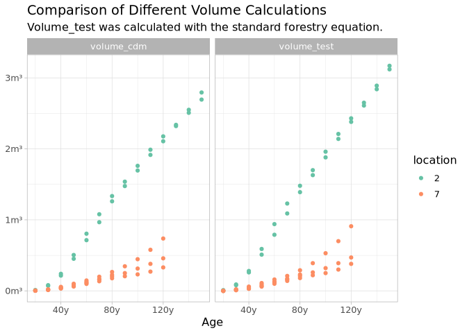
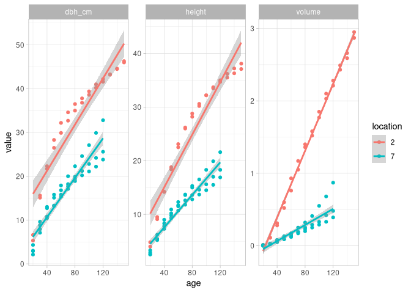
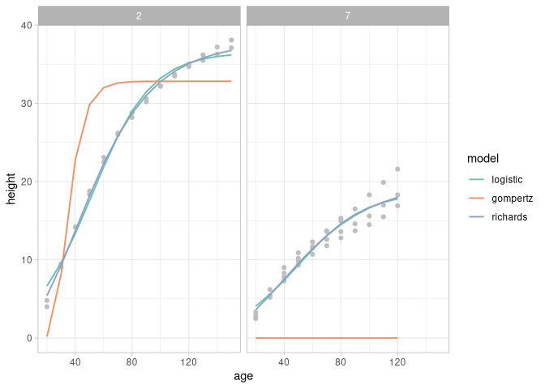
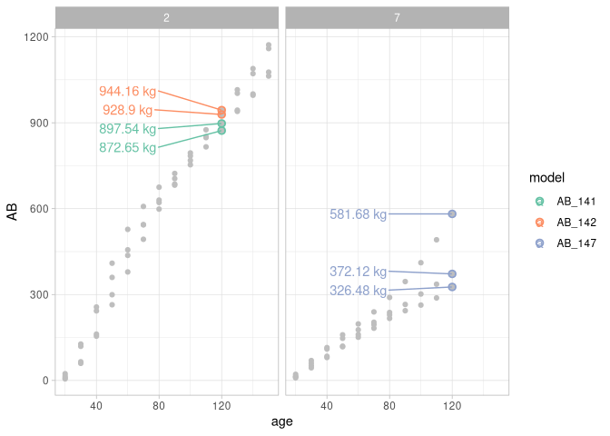

# Methods of Process Modelling
Max Arthur Hachemeister
2026-02-20

- [Prerequisites](#prerequisites)
- [The task](#the-task)
  - [Technical](#technical)
  - [Content](#content)
  - [Remark](#remark)
- [The data](#the-data)
  - [Data dictionary](#data-dictionary)
- [Fumbling around](#fumbling-around)
  - [Import](#import)
- [Explore](#explore)
  - [Summary](#summary)
  - [Common tree height](#common-tree-height)
  - [Volume calculations](#volume-calculations)
  - [Visualize](#visualize)
- [Forest Growth Models](#forest-growth-models)
  - [Define Function and Parameters](#define-function-and-parameters)
  - [Model calibration](#model-calibration)
  - [Check the results](#check-the-results)
  - [Residuals](#residuals)
  - [Allometric models](#allometric-models)
    - [Define the model and its
      parameters](#define-the-model-and-its-parameters)
    - [Plot it also, maybe:](#plot-it-also-maybe)
    - [TODO Maybe model the one missing tree with his 120
      years.](#todo-maybe-model-the-one-missing-tree-with-his-120-years)

# Prerequisites

    ── Attaching core tidyverse packages ──────────────────────── tidyverse 2.0.0 ──
    ✔ dplyr     1.1.4     ✔ readr     2.1.6
    ✔ forcats   1.0.1     ✔ stringr   1.6.0
    ✔ ggplot2   4.0.1     ✔ tibble    3.3.0
    ✔ lubridate 1.9.4     ✔ tidyr     1.3.2
    ✔ purrr     1.2.0     
    ── Conflicts ────────────────────────────────────────── tidyverse_conflicts() ──
    ✖ dplyr::filter() masks stats::filter()
    ✖ dplyr::lag()    masks stats::lag()
    ℹ Use the conflicted package (<http://conflicted.r-lib.org/>) to force all conflicts to become errors
    ── Attaching packages ────────────────────────────────────── tidymodels 1.4.1 ──

    ✔ broom        1.0.11     ✔ rsample      1.3.1 
    ✔ dials        1.4.2      ✔ tailor       0.1.0 
    ✔ infer        1.1.0      ✔ tune         2.0.1 
    ✔ modeldata    1.5.1      ✔ workflows    1.3.0 
    ✔ parsnip      1.4.0      ✔ workflowsets 1.1.1 
    ✔ recipes      1.3.1      ✔ yardstick    1.3.2 

    ── Conflicts ───────────────────────────────────────── tidymodels_conflicts() ──
    ✖ scales::discard() masks purrr::discard()
    ✖ dplyr::filter()   masks stats::filter()
    ✖ recipes::fixed()  masks stringr::fixed()
    ✖ dplyr::lag()      masks stats::lag()
    ✖ yardstick::spec() masks readr::spec()
    ✖ recipes::step()   masks stats::step()

    Loading required package: lattice

    Loading required package: deSolve

    Attaching package: 'growthrates'

    The following object is masked from 'package:dials':

        cost

# The task

## Technical

- 6 Pages Minimum

## Content

- Compare the the observed growth of *Picea abies* of two different
  locations
- Select and fit appropriate forest growth models
  - Visualize the growth at both locations and compare
  - Present the fitted models
    - With respect to their coefficients
- Select a suitable allometric model to calculate
  - Above-ground Biomass (average)
  - 120 year old tree
  - For each location
- Reflect and describe *precisely* the reasons for selecting the
  allometric models
  - Range, sample size, coefficient of determination
  - Present the respective results
- Interpret and discuss the results with respect to the differences
  between the two locations
  - stand composition, climate conditions, elevation, etc.
- Create a document, following scientific writing principles

## Remark

> It is not necessary to document every processing step of the data
> and/or your script when working through the task. You may name and
> cite the respective software and/or packages.
>
> Concentrate on explaining and introducing the selected approach as
> well as most important settings, on the results, their presentation
> (tables, figures, etc.), and interpretation.
>
> Do not forget to give references and transparently note when you used
> further tools.

# The data

## Data dictionary

<table>
<colgroup>
<col style="width: 13%" />
<col style="width: 86%" />
</colgroup>
<thead>
<tr>
<th>Variable</th>
<th>Description</th>
</tr>
</thead>
<tbody>
<tr>
<td>location</td>
<td>
2 = cold temperate climate, altitude &gt; 1000 m above sea
level

7 = temperate climate, altitude &lt; 1000 m above sea level
(e.g. Harz, Germany)
</td>
</tr>
<tr>
<td>tree</td>
<td>ID of observed <em>Picea abies</em> tree</td>
</tr>
<tr>
<td>age.base</td>
<td><strong>Age</strong> of respective tree [years]</td>
</tr>
<tr>
<td>height</td>
<td>Measured <strong>stem height</strong> of respective tree and age
[m]</td>
</tr>
<tr>
<td>dbh.cm</td>
<td>Measured stem <strong>diameter at breast height</strong> [cm]</td>
</tr>
<tr>
<td>volume</td>
<td>calculated <strong>stem volume</strong> per tree and age [m³]</td>
</tr>
</tbody>
</table>

# Fumbling around

## Import

    # A tibble: 68 × 6
       location tree    age height dbh_cm volume
       <fct>    <fct> <int>  <dbl>  <dbl>  <dbl>
     1 2        1        20    4.8    6.6     11
     2 2        1        30    9.5   15.6     80
     3 2        1        40   14.2   22.3    240
     4 2        1        50   18.8   28.3    505
     5 2        1        60   23.1   32.2    805
     6 2        1        70   26.2   34.6   1079
     7 2        1        80   28.2   36.5   1335
     8 2        1        90   30.2   37.8   1538
     9 2        1       100   32.2   39.4   1761
    10 2        1       110   33.5   41     1988
    # ℹ 58 more rows

# Explore

## Summary

Always nice!

     location tree         age             height           dbh_cm     
     2:28     1 :14   Min.   : 20.00   Min.   : 2.500   Min.   : 2.10  
     7:40     2 :14   1st Qu.: 40.00   1st Qu.: 9.725   1st Qu.:15.10  
              11: 7   Median : 70.00   Median :14.550   Median :21.45  
              13:11   Mean   : 74.12   Mean   :17.550   Mean   :23.42  
              14:11   3rd Qu.:100.00   3rd Qu.:26.050   3rd Qu.:33.25  
              15:11   Max.   :150.00   Max.   :38.100   Max.   :46.30  
         volume       
     Min.   :   1.80  
     1st Qu.:  77.75  
     Median : 236.00  
     Mean   : 657.73  
     3rd Qu.: 995.00  
     Max.   :2794.00  

There are more observations for location 7, however, the two trees at
location 2 have the most respective observations, which in this case
just means that they have been observed for the longest total time
period. Let’s check that:

    # A tibble: 6 × 4
      tree      n min_age max_age
      <fct> <int>   <int>   <int>
    1 1        14      20     150
    2 2        14      20     150
    3 11        7      20      80
    4 13       11      20     120
    5 14       11      20     120
    6 15       11      20     120

## Common tree height

Good, all trees have been measured first with 20 years, and the minimal
`max_age` is 80 let’s compare the trees at that age:

    # A tibble: 6 × 6
      location tree    age height dbh_cm volume
      <fct>    <fct> <int>  <dbl>  <dbl>  <dbl>
    1 2        1        80   28.2   36.5   1335
    2 2        2        80   28.8   35     1261
    3 7        11       80   15.3   19.4    225
    4 7        13       80   12.8   18.9    177
    5 7        14       80   13.6   19.9    203
    6 7        15       80   15     22.3    266

Location seems to explain the most of the differences in the other
variables, interesting.

## Volume calculations

Let’s check how the volume got to be, because this was calculated, but
the equation was not given in the data dictionary.

Let’s start with the basic forestry equation of
$m^3 =\frac{\pi}{4} d^2 \cdot h \cdot f \cdot 0.001$, with $f = 0.5$

    # A tibble: 68 × 7
       location tree    age height dbh_cm volume volume_test
       <fct>    <fct> <int>  <dbl>  <dbl>  <dbl>       <dbl>
     1 2        1        20    4.8    6.6     11       0.008
     2 2        1        30    9.5   15.6     80       0.091
     3 2        1        40   14.2   22.3    240       0.277
     4 2        1        50   18.8   28.3    505       0.591
     5 2        1        60   23.1   32.2    805       0.941
     6 2        1        70   26.2   34.6   1079       1.23 
     7 2        1        80   28.2   36.5   1335       1.48 
     8 2        1        90   30.2   37.8   1538       1.70 
     9 2        1       100   32.2   39.4   1761       1.96 
    10 2        1       110   33.5   41     1988       2.21 
    # ℹ 58 more rows

The original volume values seem quite high for cubic meters. Maybe it’s
cubic or centimeters, or decimeters?

I guess it’s decimeters, so adjusting the original volume values by
0.001:

Yep, something like that, with a correction factor of 0.001. Still some
difference! I became skeptical of calculations I did not do in my own
scripts. Let’s consider for now, that the original `volume` values might
be right, but the actual equation is unknown so the values are
unreliable.

Basically it is not known which *volume* in particular was calculated.
Ah, now that I look at the data dictionary it’s the *stem volume*.

The equation above is the standard for merchantable wood; i.e., every
part of a tree where $d >= 7cm$. Let’s try the $DENZIN$ (Kramer and Akça
2008)equation and then move on.

The equation is:

$$
V = 2(d^{2}/1000) \cdot (h - NH) \cdot Volumenkorrekturfaktor
$$

where:

- $d = \text{DBH, [cm]}$
- $h = \text{Total tree height, [m]}$
- $NH = \text{"Normalhöhe", aka. height of a standard tree}$
- $\text{Volumenkorrekturfaktor} = \text{Reduction factor}$

<!-- -->

    # A tibble: 68 × 5
       location tree  volume_denzin volume_forest volume_dcm
       <fct>    <fct>         <dbl>         <dbl>      <dbl>
     1 2        1              0.02         0.008       0.01
     2 2        1              0.12         0.091       0.08
     3 2        1              0.31         0.277       0.24
     4 2        1              0.61         0.591       0.5 
     5 2        1              0.94         0.941       0.8 
     6 2        1              1.21         1.23        1.08
     7 2        1              1.43         1.48        1.33
     8 2        1              1.64         1.70        1.54
     9 2        1              1.88         1.96        1.76
    10 2        1              2.1          2.21        1.99
    # ℹ 58 more rows

Gotcha, maybe some rounding divergence. Ahja I didn’t round down to full
centimeters. Let’s do that and see:

    # A tibble: 68 × 5
       location tree  volume_denzin volume_forest volume_dcm
       <fct>    <fct>         <dbl>         <dbl>      <dbl>
     1 2        1              0.01         0.008       0.01
     2 2        1              0.11         0.091       0.08
     3 2        1              0.31         0.277       0.24
     4 2        1              0.6          0.591       0.5 
     5 2        1              0.93         0.941       0.8 
     6 2        1              1.17         1.23        1.08
     7 2        1              1.4          1.48        1.33
     8 2        1              1.58         1.70        1.54
     9 2        1              1.85         1.96        1.76
    10 2        1              2.1          2.21        1.99
    # ℹ 58 more rows

Still a little off, so let’s stick with $DENZIN$ and rounding down, so
that I at least know how the values got to be:

## Visualize

Let’s compare the two locations visually. I let simple linear
regressions be fitted for each location:

Okay, looks like the location is a rather significant predictor for the
size in our data. Let’s see how location and tree would be employed by a
linear regression:

                   Estimate Std. Error    t value     Pr(>|t|)
    (Intercept)  1.44500000  0.1717641  8.4127028 7.630190e-12
    location7   -1.12681818  0.2589441 -4.3515891 5.142084e-05
    tree2       -0.03642857  0.2429111 -0.1499667 8.812777e-01
    tree11      -0.21389610  0.3107329 -0.6883601 4.937937e-01
    tree13      -0.14454545  0.2740406 -0.5274599 5.997568e-01
    tree14      -0.10818182  0.2740406 -0.3947656 6.943707e-01

Yes, the both locations - `location 2` being the `intercept` - are
strong predictors for the tree volume, according to the data we have;
which is not much.

# Forest Growth Models

Since the locations affect the trees growth, the data set is split to
fit the models respectively.

### Define Function and Parameters

### Model calibration

    [[1]]
            2         7 
     850.0154 6312.8900 

    [[2]]
           2        7 
    29.42745 63.91110 

    # A tibble: 68 × 1
       height_gompertz
                 <dbl>
     1           0.165
     2           8.20 
     3          22.8  
     4          29.8  
     5          32.0  
     6          32.6  
     7          32.8  
     8          32.8  
     9          32.8  
    10          32.8  
    # ℹ 58 more rows

### Check the results

### Residuals

#### Prepare rownames

#### Squared Sum of Residuals

    # A tibble: 3 × 3
      model        l2     l7
      <chr>     <dbl>  <dbl>
    1 richards   9.47   56.0
    2 logistic  29.4    63.9
    3 gompertz 850.   6313. 

    [1] 29.42745

#### R Squared

    # A tibble: 3 × 3
      model       l2    l7
      <chr>    <dbl> <dbl>
    1 richards 0.997 0.941
    2 logistic 0.990 0.933
    3 gompertz 0.742 0    

#### Predict new values and plot

## Allometric models

- Select a suitable allometric model to calculate
  - Above-ground Biomass (average)
  - 120 year old tree
  - For each location

### Define the model and its parameters

We’re interested in the (average) Above Ground Biomass, and the date
above has shown, that the locations are quite different, therefore the
models should be diligently selected.

What do we know:

- Species: Picea abies
- Location 7: Probably Germany
- Location 2: \>1000m above sea level, and cold temperate
  - according to the wikipedia for both: austria
    - but no AB model for that
    - Elevation, norway, sweden maybe, but climate bit too cold
    - Czec republic, fits both reasonably well.
- Diameter and Height ranges

<!-- -->

    # A tibble: 2 × 5
      location min_diameter max_diameter min_height max_height
      <fct>           <dbl>        <dbl>      <dbl>      <dbl>
    1 2                 5.3         46.3        4         38.1
    2 7                 2.1         32.8        2.5       21.6

Both Czech are probably the same sample just either with meter, or not,
so take both:

- 141
- 142

Germany, let’s see:

- 147
  - does not have the minimum range, but the max range is fine; also has
    the most samples, and the only R² mention

Let’s define the models and their standard parameter values:

And apply those models to the dataset:

It should be noted that $AB = \text{Above Ground Biomass [kg]}$

    # A tibble: 2 × 5
      location   age AB_141 AB_142 AB_147
      <fct>    <int>  <dbl>  <dbl>  <dbl>
    1 2          120   885.   937.    NA 
    2 7          120    NA     NA    427.

### Plot it also, maybe:

### TODO Maybe model the one missing tree with his 120 years.

Not all trees have been measured at 120 years. We can use the growth
models we fit to predict those values though:

Ah, no we can’t yet because the models were fit for height only. So I
would nee to fit another model for diameter.

    Warning in regularize.values(x, y, ties, missing(ties), na.rm = na.rm):
    collapsing to unique 'x' values
    Warning in regularize.values(x, y, ties, missing(ties), na.rm = na.rm):
    collapsing to unique 'x' values
    Warning in regularize.values(x, y, ties, missing(ties), na.rm = na.rm):
    collapsing to unique 'x' values
    Warning in regularize.values(x, y, ties, missing(ties), na.rm = na.rm):
    collapsing to unique 'x' values
    Warning in regularize.values(x, y, ties, missing(ties), na.rm = na.rm):
    collapsing to unique 'x' values
    Warning in regularize.values(x, y, ties, missing(ties), na.rm = na.rm):
    collapsing to unique 'x' values
    Warning in regularize.values(x, y, ties, missing(ties), na.rm = na.rm):
    collapsing to unique 'x' values
    Warning in regularize.values(x, y, ties, missing(ties), na.rm = na.rm):
    collapsing to unique 'x' values
    Warning in regularize.values(x, y, ties, missing(ties), na.rm = na.rm):
    collapsing to unique 'x' values
    Warning in regularize.values(x, y, ties, missing(ties), na.rm = na.rm):
    collapsing to unique 'x' values
    Warning in regularize.values(x, y, ties, missing(ties), na.rm = na.rm):
    collapsing to unique 'x' values
    Warning in regularize.values(x, y, ties, missing(ties), na.rm = na.rm):
    collapsing to unique 'x' values
    Warning in regularize.values(x, y, ties, missing(ties), na.rm = na.rm):
    collapsing to unique 'x' values
    Warning in regularize.values(x, y, ties, missing(ties), na.rm = na.rm):
    collapsing to unique 'x' values
    Warning in regularize.values(x, y, ties, missing(ties), na.rm = na.rm):
    collapsing to unique 'x' values
    Warning in regularize.values(x, y, ties, missing(ties), na.rm = na.rm):
    collapsing to unique 'x' values
    Warning in regularize.values(x, y, ties, missing(ties), na.rm = na.rm):
    collapsing to unique 'x' values
    Warning in regularize.values(x, y, ties, missing(ties), na.rm = na.rm):
    collapsing to unique 'x' values
    Warning in regularize.values(x, y, ties, missing(ties), na.rm = na.rm):
    collapsing to unique 'x' values
    Warning in regularize.values(x, y, ties, missing(ties), na.rm = na.rm):
    collapsing to unique 'x' values
    Warning in regularize.values(x, y, ties, missing(ties), na.rm = na.rm):
    collapsing to unique 'x' values
    Warning in regularize.values(x, y, ties, missing(ties), na.rm = na.rm):
    collapsing to unique 'x' values
    Warning in regularize.values(x, y, ties, missing(ties), na.rm = na.rm):
    collapsing to unique 'x' values
    Warning in regularize.values(x, y, ties, missing(ties), na.rm = na.rm):
    collapsing to unique 'x' values
    Warning in regularize.values(x, y, ties, missing(ties), na.rm = na.rm):
    collapsing to unique 'x' values
    Warning in regularize.values(x, y, ties, missing(ties), na.rm = na.rm):
    collapsing to unique 'x' values
    Warning in regularize.values(x, y, ties, missing(ties), na.rm = na.rm):
    collapsing to unique 'x' values
    Warning in regularize.values(x, y, ties, missing(ties), na.rm = na.rm):
    collapsing to unique 'x' values
    Warning in regularize.values(x, y, ties, missing(ties), na.rm = na.rm):
    collapsing to unique 'x' values
    Warning in regularize.values(x, y, ties, missing(ties), na.rm = na.rm):
    collapsing to unique 'x' values
    Warning in regularize.values(x, y, ties, missing(ties), na.rm = na.rm):
    collapsing to unique 'x' values
    Warning in regularize.values(x, y, ties, missing(ties), na.rm = na.rm):
    collapsing to unique 'x' values
    Warning in regularize.values(x, y, ties, missing(ties), na.rm = na.rm):
    collapsing to unique 'x' values
    Warning in regularize.values(x, y, ties, missing(ties), na.rm = na.rm):
    collapsing to unique 'x' values
    Warning in regularize.values(x, y, ties, missing(ties), na.rm = na.rm):
    collapsing to unique 'x' values
    Warning in regularize.values(x, y, ties, missing(ties), na.rm = na.rm):
    collapsing to unique 'x' values
    Warning in regularize.values(x, y, ties, missing(ties), na.rm = na.rm):
    collapsing to unique 'x' values
    Warning in regularize.values(x, y, ties, missing(ties), na.rm = na.rm):
    collapsing to unique 'x' values
    Warning in regularize.values(x, y, ties, missing(ties), na.rm = na.rm):
    collapsing to unique 'x' values
    Warning in regularize.values(x, y, ties, missing(ties), na.rm = na.rm):
    collapsing to unique 'x' values
    Warning in regularize.values(x, y, ties, missing(ties), na.rm = na.rm):
    collapsing to unique 'x' values
    Warning in regularize.values(x, y, ties, missing(ties), na.rm = na.rm):
    collapsing to unique 'x' values
    Warning in regularize.values(x, y, ties, missing(ties), na.rm = na.rm):
    collapsing to unique 'x' values
    Warning in regularize.values(x, y, ties, missing(ties), na.rm = na.rm):
    collapsing to unique 'x' values
    Warning in regularize.values(x, y, ties, missing(ties), na.rm = na.rm):
    collapsing to unique 'x' values
    Warning in regularize.values(x, y, ties, missing(ties), na.rm = na.rm):
    collapsing to unique 'x' values
    Warning in regularize.values(x, y, ties, missing(ties), na.rm = na.rm):
    collapsing to unique 'x' values
    Warning in regularize.values(x, y, ties, missing(ties), na.rm = na.rm):
    collapsing to unique 'x' values
    Warning in regularize.values(x, y, ties, missing(ties), na.rm = na.rm):
    collapsing to unique 'x' values
    Warning in regularize.values(x, y, ties, missing(ties), na.rm = na.rm):
    collapsing to unique 'x' values
    Warning in regularize.values(x, y, ties, missing(ties), na.rm = na.rm):
    collapsing to unique 'x' values
    Warning in regularize.values(x, y, ties, missing(ties), na.rm = na.rm):
    collapsing to unique 'x' values
    Warning in regularize.values(x, y, ties, missing(ties), na.rm = na.rm):
    collapsing to unique 'x' values
    Warning in regularize.values(x, y, ties, missing(ties), na.rm = na.rm):
    collapsing to unique 'x' values
    Warning in regularize.values(x, y, ties, missing(ties), na.rm = na.rm):
    collapsing to unique 'x' values
    Warning in regularize.values(x, y, ties, missing(ties), na.rm = na.rm):
    collapsing to unique 'x' values
    Warning in regularize.values(x, y, ties, missing(ties), na.rm = na.rm):
    collapsing to unique 'x' values
    Warning in regularize.values(x, y, ties, missing(ties), na.rm = na.rm):
    collapsing to unique 'x' values
    Warning in regularize.values(x, y, ties, missing(ties), na.rm = na.rm):
    collapsing to unique 'x' values
    Warning in regularize.values(x, y, ties, missing(ties), na.rm = na.rm):
    collapsing to unique 'x' values
    Warning in regularize.values(x, y, ties, missing(ties), na.rm = na.rm):
    collapsing to unique 'x' values
    Warning in regularize.values(x, y, ties, missing(ties), na.rm = na.rm):
    collapsing to unique 'x' values
    Warning in regularize.values(x, y, ties, missing(ties), na.rm = na.rm):
    collapsing to unique 'x' values
    Warning in regularize.values(x, y, ties, missing(ties), na.rm = na.rm):
    collapsing to unique 'x' values
    Warning in regularize.values(x, y, ties, missing(ties), na.rm = na.rm):
    collapsing to unique 'x' values
    Warning in regularize.values(x, y, ties, missing(ties), na.rm = na.rm):
    collapsing to unique 'x' values
    Warning in regularize.values(x, y, ties, missing(ties), na.rm = na.rm):
    collapsing to unique 'x' values
    Warning in regularize.values(x, y, ties, missing(ties), na.rm = na.rm):
    collapsing to unique 'x' values
    Warning in regularize.values(x, y, ties, missing(ties), na.rm = na.rm):
    collapsing to unique 'x' values
    Warning in regularize.values(x, y, ties, missing(ties), na.rm = na.rm):
    collapsing to unique 'x' values
    Warning in regularize.values(x, y, ties, missing(ties), na.rm = na.rm):
    collapsing to unique 'x' values
    Warning in regularize.values(x, y, ties, missing(ties), na.rm = na.rm):
    collapsing to unique 'x' values
    Warning in regularize.values(x, y, ties, missing(ties), na.rm = na.rm):
    collapsing to unique 'x' values
    Warning in regularize.values(x, y, ties, missing(ties), na.rm = na.rm):
    collapsing to unique 'x' values
    Warning in regularize.values(x, y, ties, missing(ties), na.rm = na.rm):
    collapsing to unique 'x' values
    Warning in regularize.values(x, y, ties, missing(ties), na.rm = na.rm):
    collapsing to unique 'x' values
    Warning in regularize.values(x, y, ties, missing(ties), na.rm = na.rm):
    collapsing to unique 'x' values
    Warning in regularize.values(x, y, ties, missing(ties), na.rm = na.rm):
    collapsing to unique 'x' values
    Warning in regularize.values(x, y, ties, missing(ties), na.rm = na.rm):
    collapsing to unique 'x' values
    Warning in regularize.values(x, y, ties, missing(ties), na.rm = na.rm):
    collapsing to unique 'x' values
    Warning in regularize.values(x, y, ties, missing(ties), na.rm = na.rm):
    collapsing to unique 'x' values
    Warning in regularize.values(x, y, ties, missing(ties), na.rm = na.rm):
    collapsing to unique 'x' values
    Warning in regularize.values(x, y, ties, missing(ties), na.rm = na.rm):
    collapsing to unique 'x' values
    Warning in regularize.values(x, y, ties, missing(ties), na.rm = na.rm):
    collapsing to unique 'x' values
    Warning in regularize.values(x, y, ties, missing(ties), na.rm = na.rm):
    collapsing to unique 'x' values
    Warning in regularize.values(x, y, ties, missing(ties), na.rm = na.rm):
    collapsing to unique 'x' values
    Warning in regularize.values(x, y, ties, missing(ties), na.rm = na.rm):
    collapsing to unique 'x' values
    Warning in regularize.values(x, y, ties, missing(ties), na.rm = na.rm):
    collapsing to unique 'x' values
    Warning in regularize.values(x, y, ties, missing(ties), na.rm = na.rm):
    collapsing to unique 'x' values
    Warning in regularize.values(x, y, ties, missing(ties), na.rm = na.rm):
    collapsing to unique 'x' values
    Warning in regularize.values(x, y, ties, missing(ties), na.rm = na.rm):
    collapsing to unique 'x' values
    Warning in regularize.values(x, y, ties, missing(ties), na.rm = na.rm):
    collapsing to unique 'x' values
    Warning in regularize.values(x, y, ties, missing(ties), na.rm = na.rm):
    collapsing to unique 'x' values
    Warning in regularize.values(x, y, ties, missing(ties), na.rm = na.rm):
    collapsing to unique 'x' values
    Warning in regularize.values(x, y, ties, missing(ties), na.rm = na.rm):
    collapsing to unique 'x' values
    Warning in regularize.values(x, y, ties, missing(ties), na.rm = na.rm):
    collapsing to unique 'x' values
    Warning in regularize.values(x, y, ties, missing(ties), na.rm = na.rm):
    collapsing to unique 'x' values
    Warning in regularize.values(x, y, ties, missing(ties), na.rm = na.rm):
    collapsing to unique 'x' values
    Warning in regularize.values(x, y, ties, missing(ties), na.rm = na.rm):
    collapsing to unique 'x' values
    Warning in regularize.values(x, y, ties, missing(ties), na.rm = na.rm):
    collapsing to unique 'x' values
    Warning in regularize.values(x, y, ties, missing(ties), na.rm = na.rm):
    collapsing to unique 'x' values
    Warning in regularize.values(x, y, ties, missing(ties), na.rm = na.rm):
    collapsing to unique 'x' values
    Warning in regularize.values(x, y, ties, missing(ties), na.rm = na.rm):
    collapsing to unique 'x' values
    Warning in regularize.values(x, y, ties, missing(ties), na.rm = na.rm):
    collapsing to unique 'x' values
    Warning in regularize.values(x, y, ties, missing(ties), na.rm = na.rm):
    collapsing to unique 'x' values
    Warning in regularize.values(x, y, ties, missing(ties), na.rm = na.rm):
    collapsing to unique 'x' values
    Warning in regularize.values(x, y, ties, missing(ties), na.rm = na.rm):
    collapsing to unique 'x' values
    Warning in regularize.values(x, y, ties, missing(ties), na.rm = na.rm):
    collapsing to unique 'x' values
    Warning in regularize.values(x, y, ties, missing(ties), na.rm = na.rm):
    collapsing to unique 'x' values
    Warning in regularize.values(x, y, ties, missing(ties), na.rm = na.rm):
    collapsing to unique 'x' values
    Warning in regularize.values(x, y, ties, missing(ties), na.rm = na.rm):
    collapsing to unique 'x' values
    Warning in regularize.values(x, y, ties, missing(ties), na.rm = na.rm):
    collapsing to unique 'x' values
    Warning in regularize.values(x, y, ties, missing(ties), na.rm = na.rm):
    collapsing to unique 'x' values
    Warning in regularize.values(x, y, ties, missing(ties), na.rm = na.rm):
    collapsing to unique 'x' values
    Warning in regularize.values(x, y, ties, missing(ties), na.rm = na.rm):
    collapsing to unique 'x' values
    Warning in regularize.values(x, y, ties, missing(ties), na.rm = na.rm):
    collapsing to unique 'x' values
    Warning in regularize.values(x, y, ties, missing(ties), na.rm = na.rm):
    collapsing to unique 'x' values
    Warning in regularize.values(x, y, ties, missing(ties), na.rm = na.rm):
    collapsing to unique 'x' values
    Warning in regularize.values(x, y, ties, missing(ties), na.rm = na.rm):
    collapsing to unique 'x' values
    Warning in regularize.values(x, y, ties, missing(ties), na.rm = na.rm):
    collapsing to unique 'x' values
    Warning in regularize.values(x, y, ties, missing(ties), na.rm = na.rm):
    collapsing to unique 'x' values
    Warning in regularize.values(x, y, ties, missing(ties), na.rm = na.rm):
    collapsing to unique 'x' values
    Warning in regularize.values(x, y, ties, missing(ties), na.rm = na.rm):
    collapsing to unique 'x' values
    Warning in regularize.values(x, y, ties, missing(ties), na.rm = na.rm):
    collapsing to unique 'x' values
    Warning in regularize.values(x, y, ties, missing(ties), na.rm = na.rm):
    collapsing to unique 'x' values
    Warning in regularize.values(x, y, ties, missing(ties), na.rm = na.rm):
    collapsing to unique 'x' values
    Warning in regularize.values(x, y, ties, missing(ties), na.rm = na.rm):
    collapsing to unique 'x' values
    Warning in regularize.values(x, y, ties, missing(ties), na.rm = na.rm):
    collapsing to unique 'x' values
    Warning in regularize.values(x, y, ties, missing(ties), na.rm = na.rm):
    collapsing to unique 'x' values
    Warning in regularize.values(x, y, ties, missing(ties), na.rm = na.rm):
    collapsing to unique 'x' values
    Warning in regularize.values(x, y, ties, missing(ties), na.rm = na.rm):
    collapsing to unique 'x' values
    Warning in regularize.values(x, y, ties, missing(ties), na.rm = na.rm):
    collapsing to unique 'x' values
    Warning in regularize.values(x, y, ties, missing(ties), na.rm = na.rm):
    collapsing to unique 'x' values
    Warning in regularize.values(x, y, ties, missing(ties), na.rm = na.rm):
    collapsing to unique 'x' values
    Warning in regularize.values(x, y, ties, missing(ties), na.rm = na.rm):
    collapsing to unique 'x' values
    Warning in regularize.values(x, y, ties, missing(ties), na.rm = na.rm):
    collapsing to unique 'x' values
    Warning in regularize.values(x, y, ties, missing(ties), na.rm = na.rm):
    collapsing to unique 'x' values
    Warning in regularize.values(x, y, ties, missing(ties), na.rm = na.rm):
    collapsing to unique 'x' values
    Warning in regularize.values(x, y, ties, missing(ties), na.rm = na.rm):
    collapsing to unique 'x' values
    Warning in regularize.values(x, y, ties, missing(ties), na.rm = na.rm):
    collapsing to unique 'x' values
    Warning in regularize.values(x, y, ties, missing(ties), na.rm = na.rm):
    collapsing to unique 'x' values
    Warning in regularize.values(x, y, ties, missing(ties), na.rm = na.rm):
    collapsing to unique 'x' values
    Warning in regularize.values(x, y, ties, missing(ties), na.rm = na.rm):
    collapsing to unique 'x' values
    Warning in regularize.values(x, y, ties, missing(ties), na.rm = na.rm):
    collapsing to unique 'x' values
    Warning in regularize.values(x, y, ties, missing(ties), na.rm = na.rm):
    collapsing to unique 'x' values
    Warning in regularize.values(x, y, ties, missing(ties), na.rm = na.rm):
    collapsing to unique 'x' values
    Warning in regularize.values(x, y, ties, missing(ties), na.rm = na.rm):
    collapsing to unique 'x' values
    Warning in regularize.values(x, y, ties, missing(ties), na.rm = na.rm):
    collapsing to unique 'x' values
    Warning in regularize.values(x, y, ties, missing(ties), na.rm = na.rm):
    collapsing to unique 'x' values
    Warning in regularize.values(x, y, ties, missing(ties), na.rm = na.rm):
    collapsing to unique 'x' values
    Warning in regularize.values(x, y, ties, missing(ties), na.rm = na.rm):
    collapsing to unique 'x' values
    Warning in regularize.values(x, y, ties, missing(ties), na.rm = na.rm):
    collapsing to unique 'x' values
    Warning in regularize.values(x, y, ties, missing(ties), na.rm = na.rm):
    collapsing to unique 'x' values
    Warning in regularize.values(x, y, ties, missing(ties), na.rm = na.rm):
    collapsing to unique 'x' values
    Warning in regularize.values(x, y, ties, missing(ties), na.rm = na.rm):
    collapsing to unique 'x' values
    Warning in regularize.values(x, y, ties, missing(ties), na.rm = na.rm):
    collapsing to unique 'x' values
    Warning in regularize.values(x, y, ties, missing(ties), na.rm = na.rm):
    collapsing to unique 'x' values
    Warning in regularize.values(x, y, ties, missing(ties), na.rm = na.rm):
    collapsing to unique 'x' values
    Warning in regularize.values(x, y, ties, missing(ties), na.rm = na.rm):
    collapsing to unique 'x' values
    Warning in regularize.values(x, y, ties, missing(ties), na.rm = na.rm):
    collapsing to unique 'x' values
    Warning in regularize.values(x, y, ties, missing(ties), na.rm = na.rm):
    collapsing to unique 'x' values
    Warning in regularize.values(x, y, ties, missing(ties), na.rm = na.rm):
    collapsing to unique 'x' values
    Warning in regularize.values(x, y, ties, missing(ties), na.rm = na.rm):
    collapsing to unique 'x' values
    Warning in regularize.values(x, y, ties, missing(ties), na.rm = na.rm):
    collapsing to unique 'x' values
    Warning in regularize.values(x, y, ties, missing(ties), na.rm = na.rm):
    collapsing to unique 'x' values
    Warning in regularize.values(x, y, ties, missing(ties), na.rm = na.rm):
    collapsing to unique 'x' values
    Warning in regularize.values(x, y, ties, missing(ties), na.rm = na.rm):
    collapsing to unique 'x' values
    Warning in regularize.values(x, y, ties, missing(ties), na.rm = na.rm):
    collapsing to unique 'x' values
    Warning in regularize.values(x, y, ties, missing(ties), na.rm = na.rm):
    collapsing to unique 'x' values
    Warning in regularize.values(x, y, ties, missing(ties), na.rm = na.rm):
    collapsing to unique 'x' values
    Warning in regularize.values(x, y, ties, missing(ties), na.rm = na.rm):
    collapsing to unique 'x' values
    Warning in regularize.values(x, y, ties, missing(ties), na.rm = na.rm):
    collapsing to unique 'x' values
    Warning in regularize.values(x, y, ties, missing(ties), na.rm = na.rm):
    collapsing to unique 'x' values
    Warning in regularize.values(x, y, ties, missing(ties), na.rm = na.rm):
    collapsing to unique 'x' values
    Warning in regularize.values(x, y, ties, missing(ties), na.rm = na.rm):
    collapsing to unique 'x' values
    Warning in regularize.values(x, y, ties, missing(ties), na.rm = na.rm):
    collapsing to unique 'x' values
    Warning in regularize.values(x, y, ties, missing(ties), na.rm = na.rm):
    collapsing to unique 'x' values
    Warning in regularize.values(x, y, ties, missing(ties), na.rm = na.rm):
    collapsing to unique 'x' values
    Warning in regularize.values(x, y, ties, missing(ties), na.rm = na.rm):
    collapsing to unique 'x' values
    Warning in regularize.values(x, y, ties, missing(ties), na.rm = na.rm):
    collapsing to unique 'x' values
    Warning in regularize.values(x, y, ties, missing(ties), na.rm = na.rm):
    collapsing to unique 'x' values
    Warning in regularize.values(x, y, ties, missing(ties), na.rm = na.rm):
    collapsing to unique 'x' values
    Warning in regularize.values(x, y, ties, missing(ties), na.rm = na.rm):
    collapsing to unique 'x' values
    Warning in regularize.values(x, y, ties, missing(ties), na.rm = na.rm):
    collapsing to unique 'x' values
    Warning in regularize.values(x, y, ties, missing(ties), na.rm = na.rm):
    collapsing to unique 'x' values
    Warning in regularize.values(x, y, ties, missing(ties), na.rm = na.rm):
    collapsing to unique 'x' values
    Warning in regularize.values(x, y, ties, missing(ties), na.rm = na.rm):
    collapsing to unique 'x' values
    Warning in regularize.values(x, y, ties, missing(ties), na.rm = na.rm):
    collapsing to unique 'x' values
    Warning in regularize.values(x, y, ties, missing(ties), na.rm = na.rm):
    collapsing to unique 'x' values
    Warning in regularize.values(x, y, ties, missing(ties), na.rm = na.rm):
    collapsing to unique 'x' values
    Warning in regularize.values(x, y, ties, missing(ties), na.rm = na.rm):
    collapsing to unique 'x' values
    Warning in regularize.values(x, y, ties, missing(ties), na.rm = na.rm):
    collapsing to unique 'x' values
    Warning in regularize.values(x, y, ties, missing(ties), na.rm = na.rm):
    collapsing to unique 'x' values
    Warning in regularize.values(x, y, ties, missing(ties), na.rm = na.rm):
    collapsing to unique 'x' values
    Warning in regularize.values(x, y, ties, missing(ties), na.rm = na.rm):
    collapsing to unique 'x' values
    Warning in regularize.values(x, y, ties, missing(ties), na.rm = na.rm):
    collapsing to unique 'x' values
    Warning in regularize.values(x, y, ties, missing(ties), na.rm = na.rm):
    collapsing to unique 'x' values
    Warning in regularize.values(x, y, ties, missing(ties), na.rm = na.rm):
    collapsing to unique 'x' values
    Warning in regularize.values(x, y, ties, missing(ties), na.rm = na.rm):
    collapsing to unique 'x' values
    Warning in regularize.values(x, y, ties, missing(ties), na.rm = na.rm):
    collapsing to unique 'x' values
    Warning in regularize.values(x, y, ties, missing(ties), na.rm = na.rm):
    collapsing to unique 'x' values
    Warning in regularize.values(x, y, ties, missing(ties), na.rm = na.rm):
    collapsing to unique 'x' values
    Warning in regularize.values(x, y, ties, missing(ties), na.rm = na.rm):
    collapsing to unique 'x' values
    Warning in regularize.values(x, y, ties, missing(ties), na.rm = na.rm):
    collapsing to unique 'x' values
    Warning in regularize.values(x, y, ties, missing(ties), na.rm = na.rm):
    collapsing to unique 'x' values
    Warning in regularize.values(x, y, ties, missing(ties), na.rm = na.rm):
    collapsing to unique 'x' values
    Warning in regularize.values(x, y, ties, missing(ties), na.rm = na.rm):
    collapsing to unique 'x' values
    Warning in regularize.values(x, y, ties, missing(ties), na.rm = na.rm):
    collapsing to unique 'x' values
    Warning in regularize.values(x, y, ties, missing(ties), na.rm = na.rm):
    collapsing to unique 'x' values
    Warning in regularize.values(x, y, ties, missing(ties), na.rm = na.rm):
    collapsing to unique 'x' values
    Warning in regularize.values(x, y, ties, missing(ties), na.rm = na.rm):
    collapsing to unique 'x' values
    Warning in regularize.values(x, y, ties, missing(ties), na.rm = na.rm):
    collapsing to unique 'x' values
    Warning in regularize.values(x, y, ties, missing(ties), na.rm = na.rm):
    collapsing to unique 'x' values
    Warning in regularize.values(x, y, ties, missing(ties), na.rm = na.rm):
    collapsing to unique 'x' values
    Warning in regularize.values(x, y, ties, missing(ties), na.rm = na.rm):
    collapsing to unique 'x' values
    Warning in regularize.values(x, y, ties, missing(ties), na.rm = na.rm):
    collapsing to unique 'x' values
    Warning in regularize.values(x, y, ties, missing(ties), na.rm = na.rm):
    collapsing to unique 'x' values
    Warning in regularize.values(x, y, ties, missing(ties), na.rm = na.rm):
    collapsing to unique 'x' values
    Warning in regularize.values(x, y, ties, missing(ties), na.rm = na.rm):
    collapsing to unique 'x' values
    Warning in regularize.values(x, y, ties, missing(ties), na.rm = na.rm):
    collapsing to unique 'x' values
    Warning in regularize.values(x, y, ties, missing(ties), na.rm = na.rm):
    collapsing to unique 'x' values
    Warning in regularize.values(x, y, ties, missing(ties), na.rm = na.rm):
    collapsing to unique 'x' values
    Warning in regularize.values(x, y, ties, missing(ties), na.rm = na.rm):
    collapsing to unique 'x' values
    Warning in regularize.values(x, y, ties, missing(ties), na.rm = na.rm):
    collapsing to unique 'x' values
    Warning in regularize.values(x, y, ties, missing(ties), na.rm = na.rm):
    collapsing to unique 'x' values
    Warning in regularize.values(x, y, ties, missing(ties), na.rm = na.rm):
    collapsing to unique 'x' values
    Warning in regularize.values(x, y, ties, missing(ties), na.rm = na.rm):
    collapsing to unique 'x' values
    Warning in regularize.values(x, y, ties, missing(ties), na.rm = na.rm):
    collapsing to unique 'x' values
    Warning in regularize.values(x, y, ties, missing(ties), na.rm = na.rm):
    collapsing to unique 'x' values
    Warning in regularize.values(x, y, ties, missing(ties), na.rm = na.rm):
    collapsing to unique 'x' values
    Warning in regularize.values(x, y, ties, missing(ties), na.rm = na.rm):
    collapsing to unique 'x' values
    Warning in regularize.values(x, y, ties, missing(ties), na.rm = na.rm):
    collapsing to unique 'x' values
    Warning in regularize.values(x, y, ties, missing(ties), na.rm = na.rm):
    collapsing to unique 'x' values
    Warning in regularize.values(x, y, ties, missing(ties), na.rm = na.rm):
    collapsing to unique 'x' values
    Warning in regularize.values(x, y, ties, missing(ties), na.rm = na.rm):
    collapsing to unique 'x' values
    Warning in regularize.values(x, y, ties, missing(ties), na.rm = na.rm):
    collapsing to unique 'x' values
    Warning in regularize.values(x, y, ties, missing(ties), na.rm = na.rm):
    collapsing to unique 'x' values
    Warning in regularize.values(x, y, ties, missing(ties), na.rm = na.rm):
    collapsing to unique 'x' values
    Warning in regularize.values(x, y, ties, missing(ties), na.rm = na.rm):
    collapsing to unique 'x' values
    Warning in regularize.values(x, y, ties, missing(ties), na.rm = na.rm):
    collapsing to unique 'x' values
    Warning in regularize.values(x, y, ties, missing(ties), na.rm = na.rm):
    collapsing to unique 'x' values
    Warning in regularize.values(x, y, ties, missing(ties), na.rm = na.rm):
    collapsing to unique 'x' values
    Warning in regularize.values(x, y, ties, missing(ties), na.rm = na.rm):
    collapsing to unique 'x' values
    Warning in regularize.values(x, y, ties, missing(ties), na.rm = na.rm):
    collapsing to unique 'x' values
    Warning in regularize.values(x, y, ties, missing(ties), na.rm = na.rm):
    collapsing to unique 'x' values
    Warning in regularize.values(x, y, ties, missing(ties), na.rm = na.rm):
    collapsing to unique 'x' values
    Warning in regularize.values(x, y, ties, missing(ties), na.rm = na.rm):
    collapsing to unique 'x' values
    Warning in regularize.values(x, y, ties, missing(ties), na.rm = na.rm):
    collapsing to unique 'x' values
    Warning in regularize.values(x, y, ties, missing(ties), na.rm = na.rm):
    collapsing to unique 'x' values
    Warning in regularize.values(x, y, ties, missing(ties), na.rm = na.rm):
    collapsing to unique 'x' values
    Warning in regularize.values(x, y, ties, missing(ties), na.rm = na.rm):
    collapsing to unique 'x' values
    Warning in regularize.values(x, y, ties, missing(ties), na.rm = na.rm):
    collapsing to unique 'x' values
    Warning in regularize.values(x, y, ties, missing(ties), na.rm = na.rm):
    collapsing to unique 'x' values
    Warning in regularize.values(x, y, ties, missing(ties), na.rm = na.rm):
    collapsing to unique 'x' values
    Warning in regularize.values(x, y, ties, missing(ties), na.rm = na.rm):
    collapsing to unique 'x' values
    Warning in regularize.values(x, y, ties, missing(ties), na.rm = na.rm):
    collapsing to unique 'x' values
    Warning in regularize.values(x, y, ties, missing(ties), na.rm = na.rm):
    collapsing to unique 'x' values
    Warning in regularize.values(x, y, ties, missing(ties), na.rm = na.rm):
    collapsing to unique 'x' values
    Warning in regularize.values(x, y, ties, missing(ties), na.rm = na.rm):
    collapsing to unique 'x' values
    Warning in regularize.values(x, y, ties, missing(ties), na.rm = na.rm):
    collapsing to unique 'x' values
    Warning in regularize.values(x, y, ties, missing(ties), na.rm = na.rm):
    collapsing to unique 'x' values
    Warning in regularize.values(x, y, ties, missing(ties), na.rm = na.rm):
    collapsing to unique 'x' values
    Warning in regularize.values(x, y, ties, missing(ties), na.rm = na.rm):
    collapsing to unique 'x' values
    Warning in regularize.values(x, y, ties, missing(ties), na.rm = na.rm):
    collapsing to unique 'x' values
    Warning in regularize.values(x, y, ties, missing(ties), na.rm = na.rm):
    collapsing to unique 'x' values
    Warning in regularize.values(x, y, ties, missing(ties), na.rm = na.rm):
    collapsing to unique 'x' values
    Warning in regularize.values(x, y, ties, missing(ties), na.rm = na.rm):
    collapsing to unique 'x' values
    Warning in regularize.values(x, y, ties, missing(ties), na.rm = na.rm):
    collapsing to unique 'x' values
    Warning in regularize.values(x, y, ties, missing(ties), na.rm = na.rm):
    collapsing to unique 'x' values
    Warning in regularize.values(x, y, ties, missing(ties), na.rm = na.rm):
    collapsing to unique 'x' values
    Warning in regularize.values(x, y, ties, missing(ties), na.rm = na.rm):
    collapsing to unique 'x' values
    Warning in regularize.values(x, y, ties, missing(ties), na.rm = na.rm):
    collapsing to unique 'x' values
    Warning in regularize.values(x, y, ties, missing(ties), na.rm = na.rm):
    collapsing to unique 'x' values
    Warning in regularize.values(x, y, ties, missing(ties), na.rm = na.rm):
    collapsing to unique 'x' values
    Warning in regularize.values(x, y, ties, missing(ties), na.rm = na.rm):
    collapsing to unique 'x' values
    Warning in regularize.values(x, y, ties, missing(ties), na.rm = na.rm):
    collapsing to unique 'x' values
    Warning in regularize.values(x, y, ties, missing(ties), na.rm = na.rm):
    collapsing to unique 'x' values
    Warning in regularize.values(x, y, ties, missing(ties), na.rm = na.rm):
    collapsing to unique 'x' values
    Warning in regularize.values(x, y, ties, missing(ties), na.rm = na.rm):
    collapsing to unique 'x' values
    Warning in regularize.values(x, y, ties, missing(ties), na.rm = na.rm):
    collapsing to unique 'x' values
    Warning in regularize.values(x, y, ties, missing(ties), na.rm = na.rm):
    collapsing to unique 'x' values
    Warning in regularize.values(x, y, ties, missing(ties), na.rm = na.rm):
    collapsing to unique 'x' values
    Warning in regularize.values(x, y, ties, missing(ties), na.rm = na.rm):
    collapsing to unique 'x' values
    Warning in regularize.values(x, y, ties, missing(ties), na.rm = na.rm):
    collapsing to unique 'x' values
    Warning in regularize.values(x, y, ties, missing(ties), na.rm = na.rm):
    collapsing to unique 'x' values
    Warning in regularize.values(x, y, ties, missing(ties), na.rm = na.rm):
    collapsing to unique 'x' values
    Warning in regularize.values(x, y, ties, missing(ties), na.rm = na.rm):
    collapsing to unique 'x' values
    Warning in regularize.values(x, y, ties, missing(ties), na.rm = na.rm):
    collapsing to unique 'x' values
    Warning in regularize.values(x, y, ties, missing(ties), na.rm = na.rm):
    collapsing to unique 'x' values
    Warning in regularize.values(x, y, ties, missing(ties), na.rm = na.rm):
    collapsing to unique 'x' values
    Warning in regularize.values(x, y, ties, missing(ties), na.rm = na.rm):
    collapsing to unique 'x' values
    Warning in regularize.values(x, y, ties, missing(ties), na.rm = na.rm):
    collapsing to unique 'x' values
    Warning in regularize.values(x, y, ties, missing(ties), na.rm = na.rm):
    collapsing to unique 'x' values
    Warning in regularize.values(x, y, ties, missing(ties), na.rm = na.rm):
    collapsing to unique 'x' values
    Warning in regularize.values(x, y, ties, missing(ties), na.rm = na.rm):
    collapsing to unique 'x' values
    Warning in regularize.values(x, y, ties, missing(ties), na.rm = na.rm):
    collapsing to unique 'x' values
    Warning in regularize.values(x, y, ties, missing(ties), na.rm = na.rm):
    collapsing to unique 'x' values
    Warning in regularize.values(x, y, ties, missing(ties), na.rm = na.rm):
    collapsing to unique 'x' values
    Warning in regularize.values(x, y, ties, missing(ties), na.rm = na.rm):
    collapsing to unique 'x' values
    Warning in regularize.values(x, y, ties, missing(ties), na.rm = na.rm):
    collapsing to unique 'x' values
    Warning in regularize.values(x, y, ties, missing(ties), na.rm = na.rm):
    collapsing to unique 'x' values
    Warning in regularize.values(x, y, ties, missing(ties), na.rm = na.rm):
    collapsing to unique 'x' values
    Warning in regularize.values(x, y, ties, missing(ties), na.rm = na.rm):
    collapsing to unique 'x' values
    Warning in regularize.values(x, y, ties, missing(ties), na.rm = na.rm):
    collapsing to unique 'x' values
    Warning in regularize.values(x, y, ties, missing(ties), na.rm = na.rm):
    collapsing to unique 'x' values
    Warning in regularize.values(x, y, ties, missing(ties), na.rm = na.rm):
    collapsing to unique 'x' values
    Warning in regularize.values(x, y, ties, missing(ties), na.rm = na.rm):
    collapsing to unique 'x' values
    Warning in regularize.values(x, y, ties, missing(ties), na.rm = na.rm):
    collapsing to unique 'x' values
    Warning in regularize.values(x, y, ties, missing(ties), na.rm = na.rm):
    collapsing to unique 'x' values
    Warning in regularize.values(x, y, ties, missing(ties), na.rm = na.rm):
    collapsing to unique 'x' values
    Warning in regularize.values(x, y, ties, missing(ties), na.rm = na.rm):
    collapsing to unique 'x' values
    Warning in regularize.values(x, y, ties, missing(ties), na.rm = na.rm):
    collapsing to unique 'x' values
    Warning in regularize.values(x, y, ties, missing(ties), na.rm = na.rm):
    collapsing to unique 'x' values
    Warning in regularize.values(x, y, ties, missing(ties), na.rm = na.rm):
    collapsing to unique 'x' values
    Warning in regularize.values(x, y, ties, missing(ties), na.rm = na.rm):
    collapsing to unique 'x' values
    Warning in regularize.values(x, y, ties, missing(ties), na.rm = na.rm):
    collapsing to unique 'x' values
    Warning in regularize.values(x, y, ties, missing(ties), na.rm = na.rm):
    collapsing to unique 'x' values
    Warning in regularize.values(x, y, ties, missing(ties), na.rm = na.rm):
    collapsing to unique 'x' values
    Warning in regularize.values(x, y, ties, missing(ties), na.rm = na.rm):
    collapsing to unique 'x' values
    Warning in regularize.values(x, y, ties, missing(ties), na.rm = na.rm):
    collapsing to unique 'x' values
    Warning in regularize.values(x, y, ties, missing(ties), na.rm = na.rm):
    collapsing to unique 'x' values
    Warning in regularize.values(x, y, ties, missing(ties), na.rm = na.rm):
    collapsing to unique 'x' values
    Warning in regularize.values(x, y, ties, missing(ties), na.rm = na.rm):
    collapsing to unique 'x' values
    Warning in regularize.values(x, y, ties, missing(ties), na.rm = na.rm):
    collapsing to unique 'x' values
    Warning in regularize.values(x, y, ties, missing(ties), na.rm = na.rm):
    collapsing to unique 'x' values
    Warning in regularize.values(x, y, ties, missing(ties), na.rm = na.rm):
    collapsing to unique 'x' values
    Warning in regularize.values(x, y, ties, missing(ties), na.rm = na.rm):
    collapsing to unique 'x' values
    Warning in regularize.values(x, y, ties, missing(ties), na.rm = na.rm):
    collapsing to unique 'x' values
    Warning in regularize.values(x, y, ties, missing(ties), na.rm = na.rm):
    collapsing to unique 'x' values
    Warning in regularize.values(x, y, ties, missing(ties), na.rm = na.rm):
    collapsing to unique 'x' values
    Warning in regularize.values(x, y, ties, missing(ties), na.rm = na.rm):
    collapsing to unique 'x' values
    Warning in regularize.values(x, y, ties, missing(ties), na.rm = na.rm):
    collapsing to unique 'x' values
    Warning in regularize.values(x, y, ties, missing(ties), na.rm = na.rm):
    collapsing to unique 'x' values
    Warning in regularize.values(x, y, ties, missing(ties), na.rm = na.rm):
    collapsing to unique 'x' values
    Warning in regularize.values(x, y, ties, missing(ties), na.rm = na.rm):
    collapsing to unique 'x' values
    Warning in regularize.values(x, y, ties, missing(ties), na.rm = na.rm):
    collapsing to unique 'x' values
    Warning in regularize.values(x, y, ties, missing(ties), na.rm = na.rm):
    collapsing to unique 'x' values
    Warning in regularize.values(x, y, ties, missing(ties), na.rm = na.rm):
    collapsing to unique 'x' values
    Warning in regularize.values(x, y, ties, missing(ties), na.rm = na.rm):
    collapsing to unique 'x' values
    Warning in regularize.values(x, y, ties, missing(ties), na.rm = na.rm):
    collapsing to unique 'x' values
    Warning in regularize.values(x, y, ties, missing(ties), na.rm = na.rm):
    collapsing to unique 'x' values
    Warning in regularize.values(x, y, ties, missing(ties), na.rm = na.rm):
    collapsing to unique 'x' values
    Warning in regularize.values(x, y, ties, missing(ties), na.rm = na.rm):
    collapsing to unique 'x' values
    Warning in regularize.values(x, y, ties, missing(ties), na.rm = na.rm):
    collapsing to unique 'x' values
    Warning in regularize.values(x, y, ties, missing(ties), na.rm = na.rm):
    collapsing to unique 'x' values
    Warning in regularize.values(x, y, ties, missing(ties), na.rm = na.rm):
    collapsing to unique 'x' values
    Warning in regularize.values(x, y, ties, missing(ties), na.rm = na.rm):
    collapsing to unique 'x' values
    Warning in regularize.values(x, y, ties, missing(ties), na.rm = na.rm):
    collapsing to unique 'x' values
    Warning in regularize.values(x, y, ties, missing(ties), na.rm = na.rm):
    collapsing to unique 'x' values
    Warning in regularize.values(x, y, ties, missing(ties), na.rm = na.rm):
    collapsing to unique 'x' values
    Warning in regularize.values(x, y, ties, missing(ties), na.rm = na.rm):
    collapsing to unique 'x' values
    Warning in regularize.values(x, y, ties, missing(ties), na.rm = na.rm):
    collapsing to unique 'x' values
    Warning in regularize.values(x, y, ties, missing(ties), na.rm = na.rm):
    collapsing to unique 'x' values
    Warning in regularize.values(x, y, ties, missing(ties), na.rm = na.rm):
    collapsing to unique 'x' values
    Warning in regularize.values(x, y, ties, missing(ties), na.rm = na.rm):
    collapsing to unique 'x' values
    Warning in regularize.values(x, y, ties, missing(ties), na.rm = na.rm):
    collapsing to unique 'x' values
    Warning in regularize.values(x, y, ties, missing(ties), na.rm = na.rm):
    collapsing to unique 'x' values
    Warning in regularize.values(x, y, ties, missing(ties), na.rm = na.rm):
    collapsing to unique 'x' values
    Warning in regularize.values(x, y, ties, missing(ties), na.rm = na.rm):
    collapsing to unique 'x' values
    Warning in regularize.values(x, y, ties, missing(ties), na.rm = na.rm):
    collapsing to unique 'x' values
    Warning in regularize.values(x, y, ties, missing(ties), na.rm = na.rm):
    collapsing to unique 'x' values
    Warning in regularize.values(x, y, ties, missing(ties), na.rm = na.rm):
    collapsing to unique 'x' values
    Warning in regularize.values(x, y, ties, missing(ties), na.rm = na.rm):
    collapsing to unique 'x' values
    Warning in regularize.values(x, y, ties, missing(ties), na.rm = na.rm):
    collapsing to unique 'x' values
    Warning in regularize.values(x, y, ties, missing(ties), na.rm = na.rm):
    collapsing to unique 'x' values
    Warning in regularize.values(x, y, ties, missing(ties), na.rm = na.rm):
    collapsing to unique 'x' values
    Warning in regularize.values(x, y, ties, missing(ties), na.rm = na.rm):
    collapsing to unique 'x' values
    Warning in regularize.values(x, y, ties, missing(ties), na.rm = na.rm):
    collapsing to unique 'x' values
    Warning in regularize.values(x, y, ties, missing(ties), na.rm = na.rm):
    collapsing to unique 'x' values
    Warning in regularize.values(x, y, ties, missing(ties), na.rm = na.rm):
    collapsing to unique 'x' values
    Warning in regularize.values(x, y, ties, missing(ties), na.rm = na.rm):
    collapsing to unique 'x' values
    Warning in regularize.values(x, y, ties, missing(ties), na.rm = na.rm):
    collapsing to unique 'x' values
    Warning in regularize.values(x, y, ties, missing(ties), na.rm = na.rm):
    collapsing to unique 'x' values
    Warning in regularize.values(x, y, ties, missing(ties), na.rm = na.rm):
    collapsing to unique 'x' values
    Warning in regularize.values(x, y, ties, missing(ties), na.rm = na.rm):
    collapsing to unique 'x' values
    Warning in regularize.values(x, y, ties, missing(ties), na.rm = na.rm):
    collapsing to unique 'x' values
    Warning in regularize.values(x, y, ties, missing(ties), na.rm = na.rm):
    collapsing to unique 'x' values
    Warning in regularize.values(x, y, ties, missing(ties), na.rm = na.rm):
    collapsing to unique 'x' values
    Warning in regularize.values(x, y, ties, missing(ties), na.rm = na.rm):
    collapsing to unique 'x' values
    Warning in regularize.values(x, y, ties, missing(ties), na.rm = na.rm):
    collapsing to unique 'x' values
    Warning in regularize.values(x, y, ties, missing(ties), na.rm = na.rm):
    collapsing to unique 'x' values
    Warning in regularize.values(x, y, ties, missing(ties), na.rm = na.rm):
    collapsing to unique 'x' values
    Warning in regularize.values(x, y, ties, missing(ties), na.rm = na.rm):
    collapsing to unique 'x' values
    Warning in regularize.values(x, y, ties, missing(ties), na.rm = na.rm):
    collapsing to unique 'x' values
    Warning in regularize.values(x, y, ties, missing(ties), na.rm = na.rm):
    collapsing to unique 'x' values
    Warning in regularize.values(x, y, ties, missing(ties), na.rm = na.rm):
    collapsing to unique 'x' values
    Warning in regularize.values(x, y, ties, missing(ties), na.rm = na.rm):
    collapsing to unique 'x' values
    Warning in regularize.values(x, y, ties, missing(ties), na.rm = na.rm):
    collapsing to unique 'x' values
    Warning in regularize.values(x, y, ties, missing(ties), na.rm = na.rm):
    collapsing to unique 'x' values
    Warning in regularize.values(x, y, ties, missing(ties), na.rm = na.rm):
    collapsing to unique 'x' values
    Warning in regularize.values(x, y, ties, missing(ties), na.rm = na.rm):
    collapsing to unique 'x' values
    Warning in regularize.values(x, y, ties, missing(ties), na.rm = na.rm):
    collapsing to unique 'x' values
    Warning in regularize.values(x, y, ties, missing(ties), na.rm = na.rm):
    collapsing to unique 'x' values
    Warning in regularize.values(x, y, ties, missing(ties), na.rm = na.rm):
    collapsing to unique 'x' values
    Warning in regularize.values(x, y, ties, missing(ties), na.rm = na.rm):
    collapsing to unique 'x' values
    Warning in regularize.values(x, y, ties, missing(ties), na.rm = na.rm):
    collapsing to unique 'x' values
    Warning in regularize.values(x, y, ties, missing(ties), na.rm = na.rm):
    collapsing to unique 'x' values
    Warning in regularize.values(x, y, ties, missing(ties), na.rm = na.rm):
    collapsing to unique 'x' values
    Warning in regularize.values(x, y, ties, missing(ties), na.rm = na.rm):
    collapsing to unique 'x' values
    Warning in regularize.values(x, y, ties, missing(ties), na.rm = na.rm):
    collapsing to unique 'x' values
    Warning in regularize.values(x, y, ties, missing(ties), na.rm = na.rm):
    collapsing to unique 'x' values
    Warning in regularize.values(x, y, ties, missing(ties), na.rm = na.rm):
    collapsing to unique 'x' values
    Warning in regularize.values(x, y, ties, missing(ties), na.rm = na.rm):
    collapsing to unique 'x' values
    Warning in regularize.values(x, y, ties, missing(ties), na.rm = na.rm):
    collapsing to unique 'x' values
    Warning in regularize.values(x, y, ties, missing(ties), na.rm = na.rm):
    collapsing to unique 'x' values
    Warning in regularize.values(x, y, ties, missing(ties), na.rm = na.rm):
    collapsing to unique 'x' values
    Warning in regularize.values(x, y, ties, missing(ties), na.rm = na.rm):
    collapsing to unique 'x' values
    Warning in regularize.values(x, y, ties, missing(ties), na.rm = na.rm):
    collapsing to unique 'x' values
    Warning in regularize.values(x, y, ties, missing(ties), na.rm = na.rm):
    collapsing to unique 'x' values
    Warning in regularize.values(x, y, ties, missing(ties), na.rm = na.rm):
    collapsing to unique 'x' values
    Warning in regularize.values(x, y, ties, missing(ties), na.rm = na.rm):
    collapsing to unique 'x' values
    Warning in regularize.values(x, y, ties, missing(ties), na.rm = na.rm):
    collapsing to unique 'x' values
    Warning in regularize.values(x, y, ties, missing(ties), na.rm = na.rm):
    collapsing to unique 'x' values
    Warning in regularize.values(x, y, ties, missing(ties), na.rm = na.rm):
    collapsing to unique 'x' values
    Warning in regularize.values(x, y, ties, missing(ties), na.rm = na.rm):
    collapsing to unique 'x' values
    Warning in regularize.values(x, y, ties, missing(ties), na.rm = na.rm):
    collapsing to unique 'x' values
    Warning in regularize.values(x, y, ties, missing(ties), na.rm = na.rm):
    collapsing to unique 'x' values
    Warning in regularize.values(x, y, ties, missing(ties), na.rm = na.rm):
    collapsing to unique 'x' values
    Warning in regularize.values(x, y, ties, missing(ties), na.rm = na.rm):
    collapsing to unique 'x' values
    Warning in regularize.values(x, y, ties, missing(ties), na.rm = na.rm):
    collapsing to unique 'x' values
    Warning in regularize.values(x, y, ties, missing(ties), na.rm = na.rm):
    collapsing to unique 'x' values
    Warning in regularize.values(x, y, ties, missing(ties), na.rm = na.rm):
    collapsing to unique 'x' values
    Warning in regularize.values(x, y, ties, missing(ties), na.rm = na.rm):
    collapsing to unique 'x' values
    Warning in regularize.values(x, y, ties, missing(ties), na.rm = na.rm):
    collapsing to unique 'x' values
    Warning in regularize.values(x, y, ties, missing(ties), na.rm = na.rm):
    collapsing to unique 'x' values
    Warning in regularize.values(x, y, ties, missing(ties), na.rm = na.rm):
    collapsing to unique 'x' values
    Warning in regularize.values(x, y, ties, missing(ties), na.rm = na.rm):
    collapsing to unique 'x' values
    Warning in regularize.values(x, y, ties, missing(ties), na.rm = na.rm):
    collapsing to unique 'x' values
    Warning in regularize.values(x, y, ties, missing(ties), na.rm = na.rm):
    collapsing to unique 'x' values
    Warning in regularize.values(x, y, ties, missing(ties), na.rm = na.rm):
    collapsing to unique 'x' values
    Warning in regularize.values(x, y, ties, missing(ties), na.rm = na.rm):
    collapsing to unique 'x' values
    Warning in regularize.values(x, y, ties, missing(ties), na.rm = na.rm):
    collapsing to unique 'x' values
    Warning in regularize.values(x, y, ties, missing(ties), na.rm = na.rm):
    collapsing to unique 'x' values
    Warning in regularize.values(x, y, ties, missing(ties), na.rm = na.rm):
    collapsing to unique 'x' values
    Warning in regularize.values(x, y, ties, missing(ties), na.rm = na.rm):
    collapsing to unique 'x' values
    Warning in regularize.values(x, y, ties, missing(ties), na.rm = na.rm):
    collapsing to unique 'x' values
    Warning in regularize.values(x, y, ties, missing(ties), na.rm = na.rm):
    collapsing to unique 'x' values
    Warning in regularize.values(x, y, ties, missing(ties), na.rm = na.rm):
    collapsing to unique 'x' values
    Warning in regularize.values(x, y, ties, missing(ties), na.rm = na.rm):
    collapsing to unique 'x' values
    Warning in regularize.values(x, y, ties, missing(ties), na.rm = na.rm):
    collapsing to unique 'x' values
    Warning in regularize.values(x, y, ties, missing(ties), na.rm = na.rm):
    collapsing to unique 'x' values
    Warning in regularize.values(x, y, ties, missing(ties), na.rm = na.rm):
    collapsing to unique 'x' values
    Warning in regularize.values(x, y, ties, missing(ties), na.rm = na.rm):
    collapsing to unique 'x' values
    Warning in regularize.values(x, y, ties, missing(ties), na.rm = na.rm):
    collapsing to unique 'x' values
    Warning in regularize.values(x, y, ties, missing(ties), na.rm = na.rm):
    collapsing to unique 'x' values
    Warning in regularize.values(x, y, ties, missing(ties), na.rm = na.rm):
    collapsing to unique 'x' values
    Warning in regularize.values(x, y, ties, missing(ties), na.rm = na.rm):
    collapsing to unique 'x' values
    Warning in regularize.values(x, y, ties, missing(ties), na.rm = na.rm):
    collapsing to unique 'x' values
    Warning in regularize.values(x, y, ties, missing(ties), na.rm = na.rm):
    collapsing to unique 'x' values
    Warning in regularize.values(x, y, ties, missing(ties), na.rm = na.rm):
    collapsing to unique 'x' values
    Warning in regularize.values(x, y, ties, missing(ties), na.rm = na.rm):
    collapsing to unique 'x' values
    Warning in regularize.values(x, y, ties, missing(ties), na.rm = na.rm):
    collapsing to unique 'x' values
    Warning in regularize.values(x, y, ties, missing(ties), na.rm = na.rm):
    collapsing to unique 'x' values
    Warning in regularize.values(x, y, ties, missing(ties), na.rm = na.rm):
    collapsing to unique 'x' values
    Warning in regularize.values(x, y, ties, missing(ties), na.rm = na.rm):
    collapsing to unique 'x' values
    Warning in regularize.values(x, y, ties, missing(ties), na.rm = na.rm):
    collapsing to unique 'x' values
    Warning in regularize.values(x, y, ties, missing(ties), na.rm = na.rm):
    collapsing to unique 'x' values
    Warning in regularize.values(x, y, ties, missing(ties), na.rm = na.rm):
    collapsing to unique 'x' values
    Warning in regularize.values(x, y, ties, missing(ties), na.rm = na.rm):
    collapsing to unique 'x' values
    Warning in regularize.values(x, y, ties, missing(ties), na.rm = na.rm):
    collapsing to unique 'x' values
    Warning in regularize.values(x, y, ties, missing(ties), na.rm = na.rm):
    collapsing to unique 'x' values
    Warning in regularize.values(x, y, ties, missing(ties), na.rm = na.rm):
    collapsing to unique 'x' values
    Warning in regularize.values(x, y, ties, missing(ties), na.rm = na.rm):
    collapsing to unique 'x' values
    Warning in regularize.values(x, y, ties, missing(ties), na.rm = na.rm):
    collapsing to unique 'x' values
    Warning in regularize.values(x, y, ties, missing(ties), na.rm = na.rm):
    collapsing to unique 'x' values
    Warning in regularize.values(x, y, ties, missing(ties), na.rm = na.rm):
    collapsing to unique 'x' values
    Warning in regularize.values(x, y, ties, missing(ties), na.rm = na.rm):
    collapsing to unique 'x' values
    Warning in regularize.values(x, y, ties, missing(ties), na.rm = na.rm):
    collapsing to unique 'x' values
    Warning in regularize.values(x, y, ties, missing(ties), na.rm = na.rm):
    collapsing to unique 'x' values
    Warning in regularize.values(x, y, ties, missing(ties), na.rm = na.rm):
    collapsing to unique 'x' values
    Warning in regularize.values(x, y, ties, missing(ties), na.rm = na.rm):
    collapsing to unique 'x' values
    Warning in regularize.values(x, y, ties, missing(ties), na.rm = na.rm):
    collapsing to unique 'x' values
    Warning in regularize.values(x, y, ties, missing(ties), na.rm = na.rm):
    collapsing to unique 'x' values
    Warning in regularize.values(x, y, ties, missing(ties), na.rm = na.rm):
    collapsing to unique 'x' values
    Warning in regularize.values(x, y, ties, missing(ties), na.rm = na.rm):
    collapsing to unique 'x' values
    Warning in regularize.values(x, y, ties, missing(ties), na.rm = na.rm):
    collapsing to unique 'x' values
    Warning in regularize.values(x, y, ties, missing(ties), na.rm = na.rm):
    collapsing to unique 'x' values
    Warning in regularize.values(x, y, ties, missing(ties), na.rm = na.rm):
    collapsing to unique 'x' values
    Warning in regularize.values(x, y, ties, missing(ties), na.rm = na.rm):
    collapsing to unique 'x' values
    Warning in regularize.values(x, y, ties, missing(ties), na.rm = na.rm):
    collapsing to unique 'x' values
    Warning in regularize.values(x, y, ties, missing(ties), na.rm = na.rm):
    collapsing to unique 'x' values
    Warning in regularize.values(x, y, ties, missing(ties), na.rm = na.rm):
    collapsing to unique 'x' values
    Warning in regularize.values(x, y, ties, missing(ties), na.rm = na.rm):
    collapsing to unique 'x' values
    Warning in regularize.values(x, y, ties, missing(ties), na.rm = na.rm):
    collapsing to unique 'x' values
    Warning in regularize.values(x, y, ties, missing(ties), na.rm = na.rm):
    collapsing to unique 'x' values
    Warning in regularize.values(x, y, ties, missing(ties), na.rm = na.rm):
    collapsing to unique 'x' values
    Warning in regularize.values(x, y, ties, missing(ties), na.rm = na.rm):
    collapsing to unique 'x' values
    Warning in regularize.values(x, y, ties, missing(ties), na.rm = na.rm):
    collapsing to unique 'x' values
    Warning in regularize.values(x, y, ties, missing(ties), na.rm = na.rm):
    collapsing to unique 'x' values
    Warning in regularize.values(x, y, ties, missing(ties), na.rm = na.rm):
    collapsing to unique 'x' values
    Warning in regularize.values(x, y, ties, missing(ties), na.rm = na.rm):
    collapsing to unique 'x' values
    Warning in regularize.values(x, y, ties, missing(ties), na.rm = na.rm):
    collapsing to unique 'x' values
    Warning in regularize.values(x, y, ties, missing(ties), na.rm = na.rm):
    collapsing to unique 'x' values
    Warning in regularize.values(x, y, ties, missing(ties), na.rm = na.rm):
    collapsing to unique 'x' values
    Warning in regularize.values(x, y, ties, missing(ties), na.rm = na.rm):
    collapsing to unique 'x' values
    Warning in regularize.values(x, y, ties, missing(ties), na.rm = na.rm):
    collapsing to unique 'x' values
    Warning in regularize.values(x, y, ties, missing(ties), na.rm = na.rm):
    collapsing to unique 'x' values
    Warning in regularize.values(x, y, ties, missing(ties), na.rm = na.rm):
    collapsing to unique 'x' values
    Warning in regularize.values(x, y, ties, missing(ties), na.rm = na.rm):
    collapsing to unique 'x' values
    Warning in regularize.values(x, y, ties, missing(ties), na.rm = na.rm):
    collapsing to unique 'x' values
    Warning in regularize.values(x, y, ties, missing(ties), na.rm = na.rm):
    collapsing to unique 'x' values
    Warning in regularize.values(x, y, ties, missing(ties), na.rm = na.rm):
    collapsing to unique 'x' values
    Warning in regularize.values(x, y, ties, missing(ties), na.rm = na.rm):
    collapsing to unique 'x' values
    Warning in regularize.values(x, y, ties, missing(ties), na.rm = na.rm):
    collapsing to unique 'x' values
    Warning in regularize.values(x, y, ties, missing(ties), na.rm = na.rm):
    collapsing to unique 'x' values

    # A tibble: 1 × 3
      model            residuals_sqsum r_squared
      <chr>                      <dbl>     <dbl>
    1 fit3_l2_diameter           0.980      72.0

Kramer, Horst, and Alparslan Akça. 2008. *Leitfaden zur Waldmesslehre*.
5., überarb. Aufl. Frankfurt am Main: Sauerländer.

